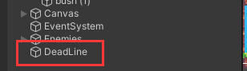
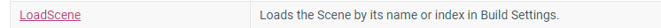
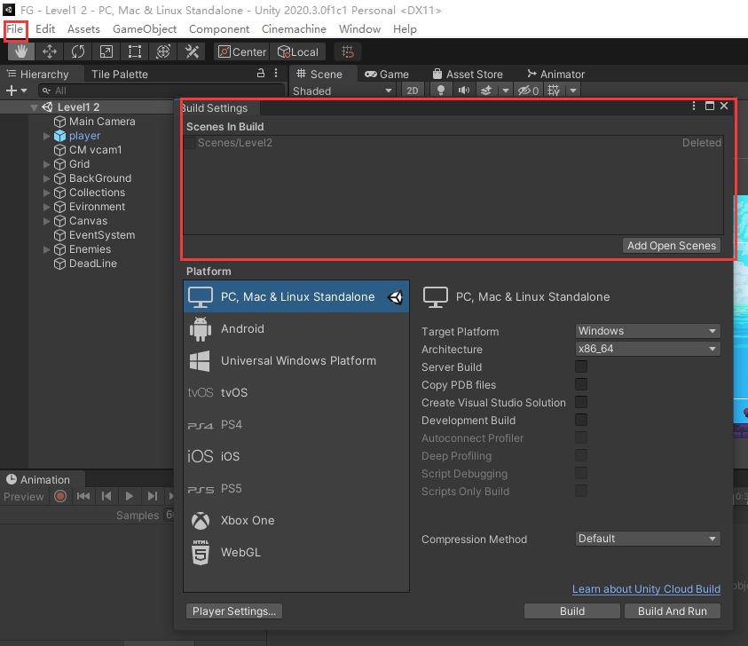
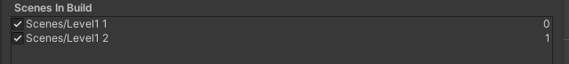
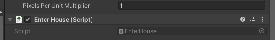

## 创造地图底部“死亡线

1. 首先创建一个空物体，取名为DeadLine，角色掉落出地图后判定死亡



2. 设计思路为角色的y坐标**小于deadline的y坐标**时，判定失败，需要进行[**场景处理SceneManger**](https://docs.unity3d.com/ScriptReference/SceneManagement.SceneManager.html)，关于如何使用SceneManger前往官网文档查看。



​		我们看到我们需要的就是这个方法，角色死亡时重载场景。

3. 编写脚本

```c#
//plyaer.cs
//添加场景类
using UnityEngine.SceneManger;

//加入死亡线和角色的transform坐标对象
public Transform deadline;
public Transform Player;

//在update中检测y值坐标
void Update(){
	//... ...
    if (deadline.position.y > Player.position.y)
    {
        //方法一，重载当前激活的场景
    	SceneManger.LoadScene(SceneManger.GetActiveScene().name);
        //方法二
        SceneManger.LoadScene("你的场景名");
    }
}
```


将transform传入角色脚本，现在就完成了场景的重载了(*^_^*)

4. 延迟重载

```c#
if (deadline.position.y > Player.position.y)
{
    GetComponent<AudioSource>().enabled = false; //关闭所有音源
	InVoke("ReStart", 2f);//延迟调用方法两秒
}

void ReStart(){
    SceneManager.LoadScene(SceneManager.GetActiveScene().name);
}
```

## 进入下一个场景

1. 新建一个脚本为enterhouse.cs

```c#
public class EnterHouse : MonoBehaviour
{
    // Update is called once per frame
    void Update()
    {
        if (Input.GetKeyDown(KeyCode.E))
        {
            SceneManager.LoadScene(SceneManager.GetActiveScene().buildIndex+1);//通过加载场景编号，当前场景的下一个场景
        }
    }
}
```

2. 设置场景编号





3. 将enterhouse的脚本拖到对话框组件中（因为我们希望在进入门时按E触发效果，需要的不是一直被激活的对象，对话框只在碰到门时出现，很合适）



4. 此时就实现场景的跳转效果了😀